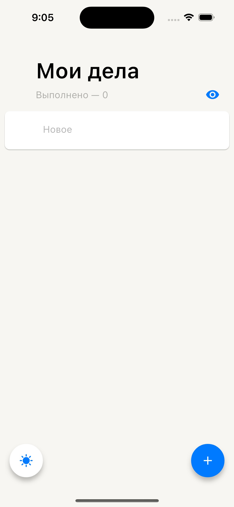
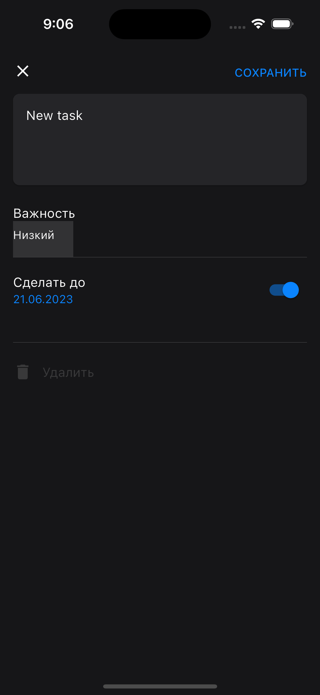

# ada_lovelace

A todo app based on [Figma](https://www.figma.com/file/gugusDLUlvMczCSDXSzpTa/%E2%9C%85-%D0%A1%D0%B4%D0%B5%D0%BB%D0%B0%D1%82%D1%8C---design?type=design&node-id=22-7326)

## Features
1. Creation, completion and deletion of different todo tasks
2. Setting deadlines and priorities of tasks
3. Light / dark themes
4. Vibrant UI design

## Screenshots

## How to use
Check the GitHub releases tab to get the latest apk.
